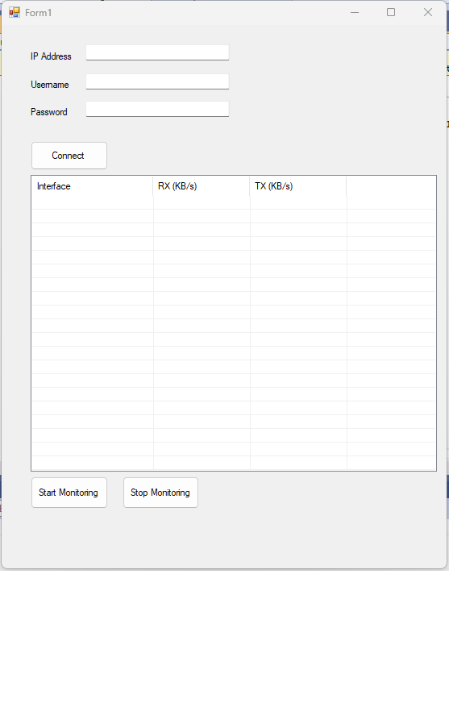

# Mikrotik Interface Monitor (VB.NET)

Aplikasi sederhana untuk memonitor **real-time traffic (RX/TX)** pada interface Mikrotik, termasuk client PPPoE.  
Dibuat menggunakan **VB.NET** dengan koneksi **MikroTik API**.

---

## ✨ Fitur
- Menampilkan traffic RX/TX setiap interface secara real-time  
- Monitoring client PPPoE  
- Tombol **Start / Stop** untuk memulai atau menghentikan monitoring  
- Tampilan data dalam **ListView**  
- Format data otomatis ke **KB, MB, GB**

---

## 🖼️ Screenshot

---

## ⚙️ Cara Menggunakan
1. Jalankan aplikasi `Traffic-Monitoring.exe`
2. Masukkan IP, Username, dan Password Mikrotik
3. Klik **Connect**
4. Tekan **Start Monitoring** untuk mulai melihat data RX/TX
5. Klik **Stop Monitoring** untuk berhenti

---

## 💡 Kebutuhan Sistem
- Windows 10 / 11  
- .NET Framework 4.8.1 ke atas  
- Mikrotik Router dengan API aktif (`/ip service enable api`)

---

## 👨‍💻 Developer
Dibuat oleh **D-Tech99 (Yatul Hamdani)**  
Channel YouTube: [D-Tech Project](https://www.youtube.com/@D-Tech-99)

---

## 🪪 License
Project ini dilisensikan di bawah [MIT License](LICENSE)

